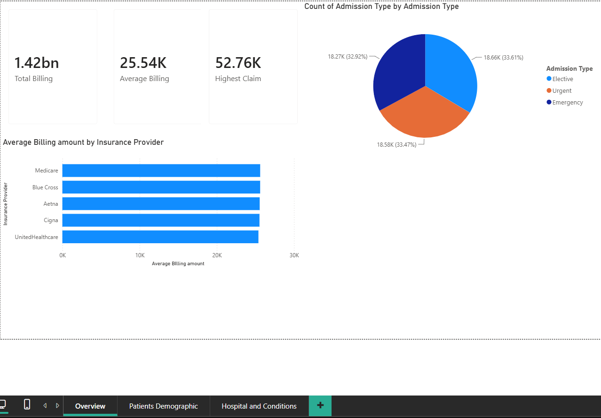
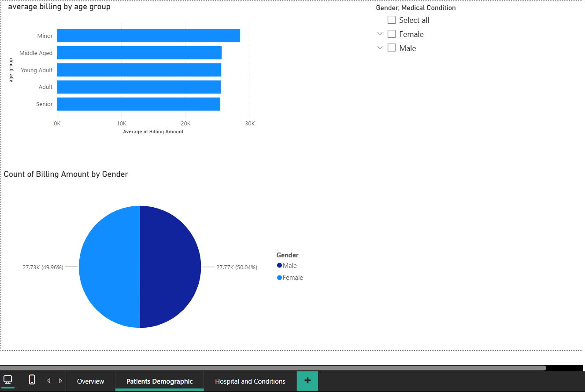
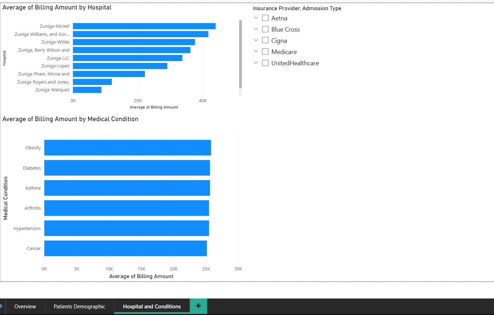

# 🏥 Healthcare Insurance & Claims Analysis

An end-to-end data analytics project analyzing healthcare insurance claims data to uncover billing patterns, cost drivers, and patient trends across hospitals, medical conditions, and insurance providers.

🔍 SQL Queries: [project_sql folder](/sql code for healthcare/)
📊 Excel Analysis: [excel folder](/Excel/)
📈 Power BI Dashboard: [powerbi folder](/PowerBI/)

---

## 📌 Table of Contents
- [Background](#background)
- [Tools & Skills Used](#tools--skills-used)
- [Dataset](#dataset)
- [SQL Analysis](#sql-analysis)
- [Excel Analysis](#excel-analysis)
- [Power BI Dashboard](#power-bi-dashboard)
- [Key Findings](#key-findings)
- [What I Learned](#what-i-learned)

---

## Background

This project was built to analyze real-world healthcare claims data and answer critical business questions about billing amounts, patient demographics, hospital performance, and insurance providers. The analysis follows a full end-to-end workflow — from raw data ingestion in PostgreSQL, to summarization in Excel, to an interactive dashboard in Power BI.

**Questions explored:**
1. What are the top 10 highest billing claims?
2. What is the average billing amount by insurance provider?
3. Which medical condition results in the highest average billing?
4. How does admission type affect average billing amount?
5. What age group has the highest average billing amount?
6. Which hospitals have the highest average billing with more than 10 claims?
7. What is the average hospital stay length per medical condition?

---

## Tools & Skills Used

| Tool | Skills Applied |
|------|---------------|
| **PostgreSQL / pgAdmin** | Data ingestion, CTEs, GROUP BY, HAVING, CASE statements, date functions, string functions, aggregations |
| **Excel** | Pivot Tables, bar charts, AVERAGEIF, XLOOKUP, conditional formatting |
| **Power BI** | KPI cards, bar charts, pie charts, slicers, Power Query conditional columns for age grouping |
| **VSCode** | Writing and organizing SQL files |
| **Git & GitHub** | Version control and project sharing |

---

## Dataset

**Source:** [Kaggle — Healthcare Dataset](https://www.kaggle.com/datasets/prasad22/healthcare-dataset)

The dataset contains 55,500 real healthcare records with the following fields:

`name, age, gender, blood_type, medical_condition, date_of_admission, doctor, hospital, insurance_provider, billing_amount, room_number, admission_type, discharge_date, medication, test_results`

---

## SQL Analysis

### 1. Top 10 Highest Billing Claims
**Skills:** SELECT, ORDER BY, ROUND, INITCAP, LIMIT

```sql
-- see project_sql/1_top_billing_claims.sql
```

**Results:**

| Patient | Billing Amount |
|---------|---------------|
| Todd Carrillo | $52,764.28 |
| Karen Kline | $52,373.03 |
| David Sandoval | $52,271.66 |
| Kathryn Gonzales | $52,211.85 |
| Brett Marshall | $52,181.84 |
| Laurie Hood | $52,170.04 |
| Justin Clark | $52,154.24 |
| Scott Powell | $52,102.24 |

> 

---

### 2. Average Billing by Insurance Provider
**Skills:** AVG, GROUP BY, ORDER BY, ROUND

```sql
-- see project_sql/2_avg_billing_by_insurance.sql
```

**Results:**

| Insurance Provider | Avg Billing |
|-------------------|-------------|
| Medicare | $25,615.99 |
| Blue Cross | $25,613.01 |
| Aetna | $25,553.29 |
| Cigna | $25,525.77 |
| UnitedHealthcare | $25,389.17 |


---

### 3. Average Billing by Medical Condition
**Skills:** AVG, GROUP BY, ORDER BY, ROUND

```sql
-- see project_sql/3_billing_by_condition.sql
```

**Results:**

| Medical Condition | Avg Billing |
|------------------|-------------|
| Obesity | $25,805.97 |
| Diabetes | $25,638.41 |
| Asthma | $25,635.25 |
| Arthritis | $25,497.33 |
| Hypertension | $25,497.10 |
| Cancer | $25,161.79 |


---

### 4. Average Billing by Admission Type
**Skills:** AVG, COUNT, GROUP BY, ORDER BY, ROUND

```sql
-- see project_sql/4_billing_by_admission_type.sql
```

**Results:**

| Admission Type | Avg Billing | No. of Claims |
|---------------|-------------|---------------|
| Elective | $25,602.23 | 18,655 |
| Urgent | $25,517.36 | 18,576 |
| Emergency | $25,497.40 | 18,269 |


---

### 5. Average Billing by Age Group
**Skills:** CASE statements, AVG, GROUP BY, ORDER BY, ROUND

```sql
-- see project_sql/5_billing_by_age_group.sql
```

Age groups were created using CASE statements to bucket patients into meaningful categories:

| Age Group | Avg Billing |
|-----------|-------------|
| Minor (0-17) | $28,512.86 |
| Middle Aged (51-65) | $25,640.01 |
| Young Adult (18-35) | $25,574.31 |
| Adult (36-50) | $25,522.15 |
| Senior (65+) | $25,423.10 |


---

### 6. Top Hospitals by Average Billing
**Skills:** AVG, COUNT, GROUP BY, HAVING, ORDER BY, ROUND

```sql
-- see project_sql/6_top_hospitals.sql
```

Only hospitals with more than 10 claims were included using HAVING.

**Top Results:**

| Hospital | Avg Billing | No. of Claims |
|----------|-------------|---------------|
| Johnson PLC | $28,531.65 | 38 |
| Smith PLC | $28,595.12 | 36 |
| Inc Brown | $31,812.73 | 28 |
| Inc Jones | $32,197.46 | 25 |


---

### 7. Average Hospital Stay by Medical Condition
**Skills:** AGE(), EXTRACT(), AVG, GROUP BY, ORDER BY, ROUND

```sql
-- see project_sql/7_avg_stay_by_condition.sql
```

Length of stay was calculated by extracting the number of days between admission and discharge dates.

| Medical Condition | Avg Stay (Days) |
|------------------|----------------|
| Asthma | 15.15 |
| Arthritis | 15.05 |
| Hypertension | 14.97 |
| Obesity | 14.94 |
| Diabetes | 14.92 |
| Cancer | 14.91 |


---

## Excel Analysis

Excel was used to further summarize and visualize the SQL findings.

### Pivot Table — Avg Billing by Insurance Provider & Admission Type
**Skills:** Pivot Tables

| | Elective | Emergency | Urgent | Grand Total |
|--|----------|-----------|--------|-------------|
| Aetna | $25,431.61 | $25,352.77 | $25,895.93 | $25,553.29 |
| Blue Cross | $25,628.97 | $25,568.70 | $25,640.44 | $25,613.01 |
| Cigna | $26,013.70 | $25,234.38 | $25,334.64 | $25,525.77 |
| Medicare | $25,640.45 | $25,596.09 | $25,611.55 | $25,615.99 |
| UnitedHealthcare | $25,303.10 | $25,740.17 | $25,137.17 | $25,389.17 |


### Bar Chart — Avg Billing by Medical Condition
**Skills:** Data visualization, bar charts

Obesity had the highest average billing at ~$25,800, followed by Diabetes and Asthma.


### AVERAGEIF — Avg Billing by Gender
**Skills:** AVERAGEIF

| Gender | Avg Billing |
|--------|-------------|
| Male | $26,494.21 |
| Female | $23,321.65 |

### XLOOKUP — Patient Billing Lookup
**Skills:** XLOOKUP

Built a dynamic lookup tool that returns a patient's billing amount by entering their name.

---

## Power BI Dashboard

An interactive 3-page dashboard was built in Power BI. Age groups were created using Power Query's Conditional Column feature, eliminating the need for DAX formulas.

### Page 1 — Overview


**Key metrics:**
- Total Billing: **$1.42bn**
- Average Billing: **$25.54K**
- Highest Claim: **$52.76K**
- Admission type split is nearly even — Elective (33.61%), Emergency (32.92%), Urgent (33.47%)
- Medicare and Blue Cross lead in average billing amount

---

### Page 2 — Patient Demographics


- Minor age group has the highest average billing at ~$28.5K
- Gender split is nearly 50/50 — Female (50.04%) vs Male (49.96%)
- Slicers allow filtering by gender and medical condition

---

### Page 3 — Hospital & Conditions


- Average billing by hospital varies significantly — top hospitals averaging over $40K
- Obesity consistently leads in average billing across conditions
- Slicers allow filtering by insurance provider and admission type

---

## Key Findings

1. **Highest Billing Claim:** Todd Carrillo had the highest single claim at $52,764.28
2. **Most Expensive Condition:** Obesity had the highest average billing at $25,805.97
3. **Insurance Provider:** Medicare had the highest average billing at $25,615.99
4. **Age Group:** Minor patients (0-17) had the highest average billing at $28,512.86 — significantly higher than all other groups
5. **Admission Type:** Elective admissions averaged the highest billing at $25,602.23
6. **Longest Hospital Stay:** Asthma patients had the longest average stay at 15.15 days
7. **Gender:** Male patients averaged slightly higher billing ($26,494) compared to female patients ($23,321)

---

## What I Learned

- **CASE statements:** Used to create custom age group buckets directly in SQL queries
- **Date calculations:** Applied AGE() and EXTRACT() to calculate length of hospital stay from two date columns
- **HAVING clause:** Filtered aggregated results to only include hospitals with more than 10 claims
- **Power Query Conditional Columns:** Created age group categories in Power BI without writing DAX
- **AVERAGEIF & XLOOKUP:** Applied advanced Excel functions to answer specific business questions
- **End-to-end workflow:** Moved data from PostgreSQL → CSV → Excel → Power BI, simulating a real analyst pipeline
